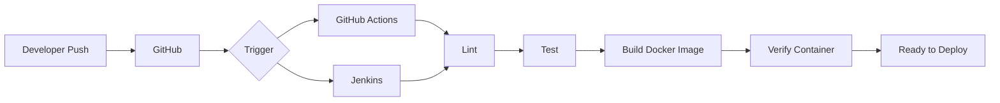
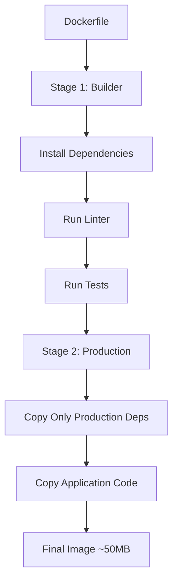

# Architecture

## CI/CD Pipeline Flow

```mermaid
flowchart LR
    A[Developer Push] --> B[GitHub]
    B --> C{Trigger}
    C --> D[GitHub Actions]
    C --> E[Jenkins]
    
    D --> F[Lint]
    E --> F
    F --> G[Test]
    G --> H[Build Docker Image]
    H --> I[Verify Container]
    I --> J[Ready to Deploy]
```

## Docker Build Process

```mermaid
flowchart TD
    A[Dockerfile] --> B[Stage 1: Builder]
    B --> C[Install Dependencies]
    C --> D[Run Linter]
    D --> E[Run Tests]
    E --> F[Stage 2: Production]
    F --> G[Copy Only Production Deps]
    G --> H[Copy Application Code]
    H --> I[Final Image ~50MB]
```
